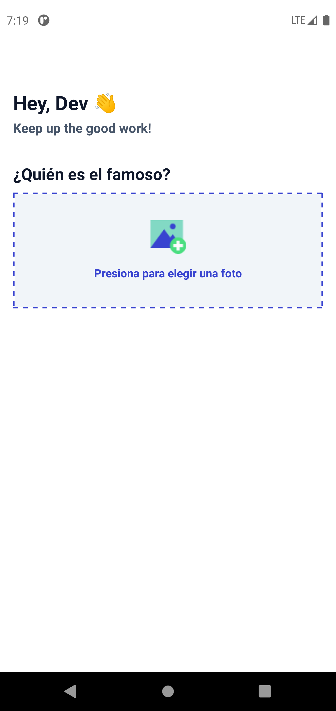
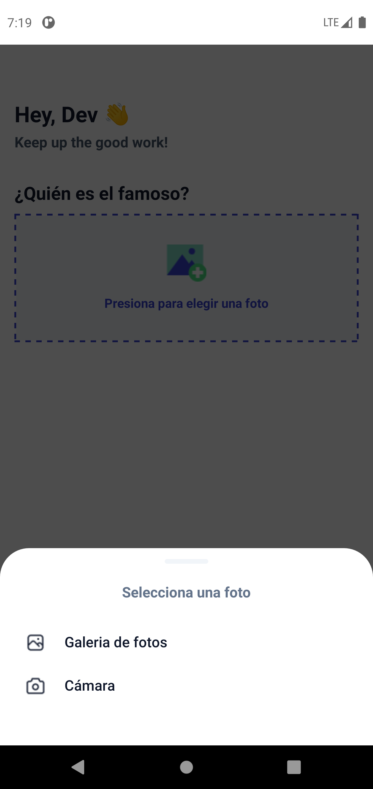
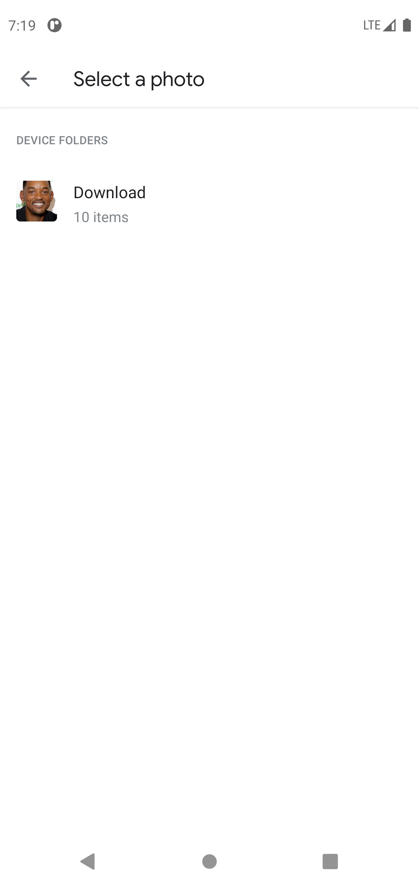
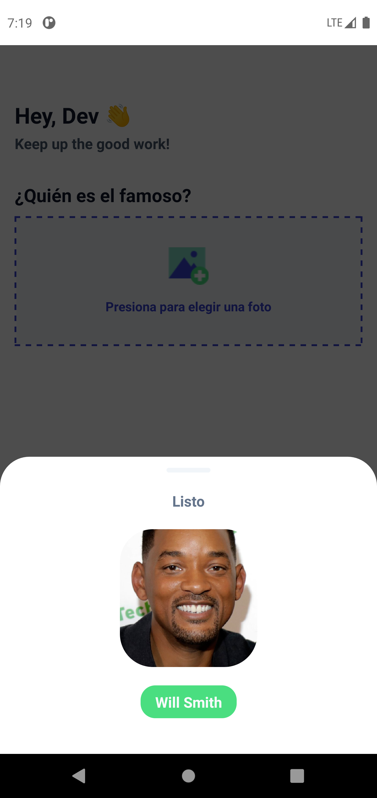
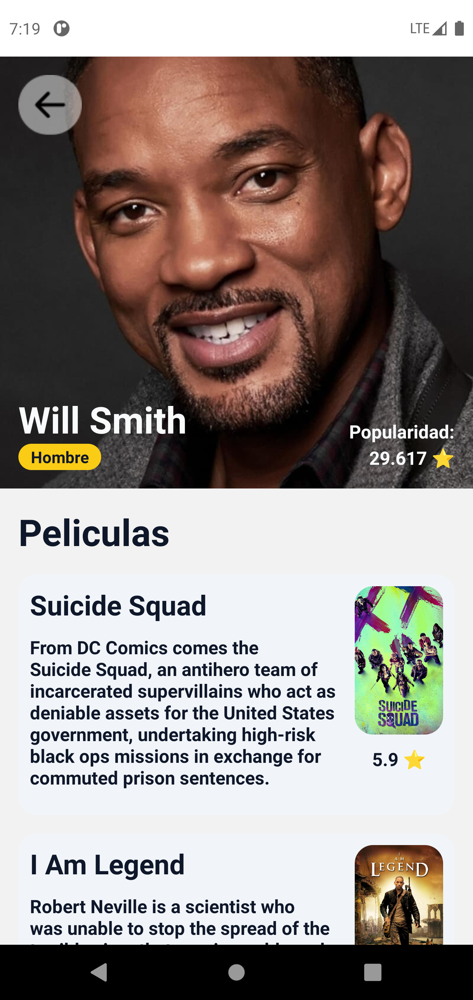
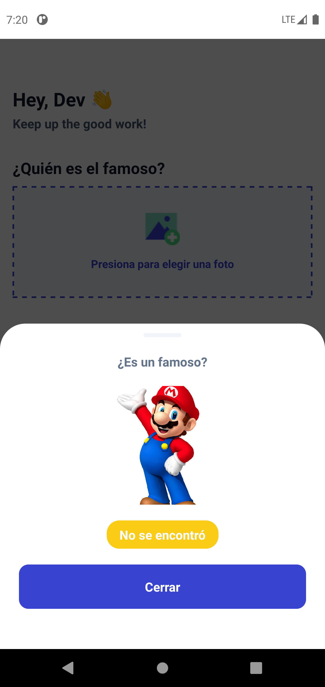
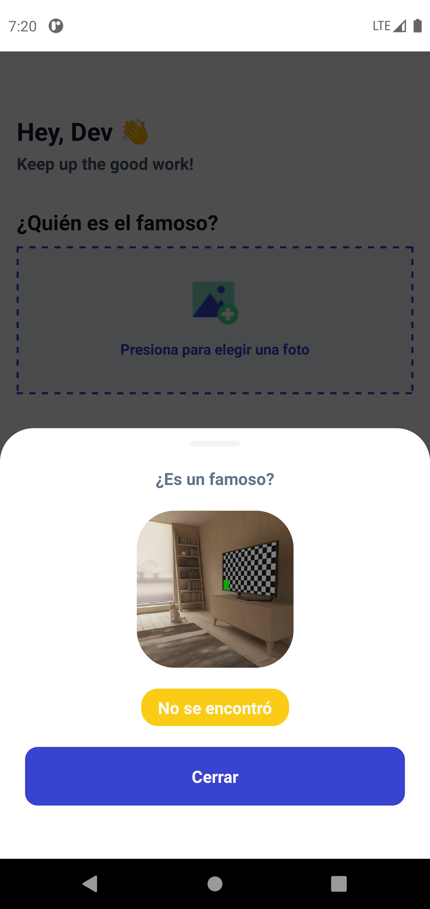
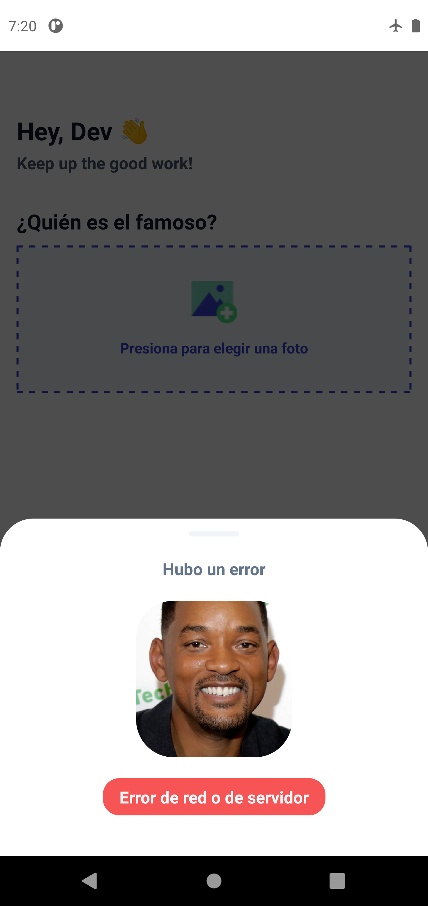
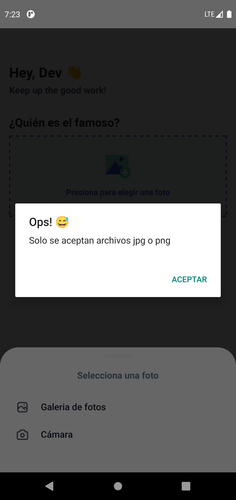

# WhoIs

An app that helps you to know who is an Actor

# Installation
To install, make `git clone`, `npm install` and `npm run android`  

# Apis used
To know if the image uploaded is an Actor or not and to fetch the name of the Actor 

1.- [Nomada API](https://whois.nomada.cloud/upload)

To know the info of the Actor 

2.- [The Movie DB API](https://developers.themoviedb.org/3/search/search-people)

To get the images of the Actor and the movies posters

3.- [The Movie DB IMAGES API](https://developers.themoviedb.org/3/getting-started/images)

# Preview Who Is App

<table>
  <tr>
    <td>Home screen</td>
     <td>Select Image from gallery</td>
     <td>Selecting Image</td>
  </tr>
  <tr>
    <td></td> 
    <td></td> 
    <td></td>  
  </tr>
 </table>
 
 <table>
  <tr>
    <td>Image loaded and actor found</td>
     <td>Details of Actor</td>
     <td>Actor not found</td>
  </tr>
  <tr>
    <td></td> 
    <td></td> 
    <td></td>  
  </tr>
 </table>
 
 <table>
  <tr>
    <td>Take a photo</td>
     <td>Photo taken don't found</td>
     <td>Network or server error</td>
  </tr>
  <tr>
    <td></td> 
    <td></td> 
    <td></td>  
  </tr>
 </table>
 
 <table>
  <tr>
    <td>PNG, pnj, JPG, or jpg are not accepted</td> 
  </tr>
  <tr>
    <td></td>  
 </table>
 
 
